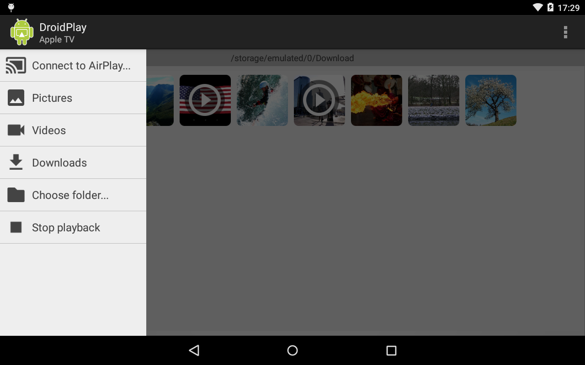
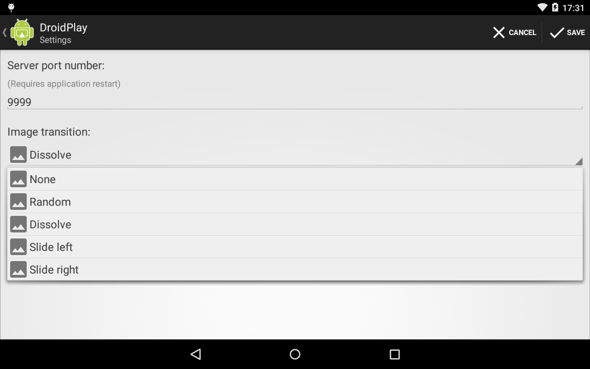

# [DroidPlay](https://github.com/warren-bank/Android-AirPlay-Client)
> <small>forked from: <a href="https://github.com/tutikka/DroidPlay/tree/8270e9524bbaea734d1ccbd8e7016929ee7861bc">tutikka/DroidPlay v0.2.4</a></small>

AirPlay (version 1) client for Android

Features
--------

- Automatic discovery of AirPlay receivers within the same network
- Beam photos from your device to AirPlay
- Stream videos and music from your device to AirPlay
- Mirror the screen from your device to AirPlay
  * only available on Android 5.0 and higher

Not Supported (yet)
-------------------

- Play videos from external services (e.g. YouTube)
- Slide shows

Screenshots
-----------

_DroidPlay_ running on Asus Nexus 7 with Android 5.1

Instructions
------------

1. Download the latest APK file from [releases](https://github.com/warren-bank/Android-AirPlay-Client/releases) and install on your device
2. Start the app and wait for services to be discovered
3. Swipe from left to right, and select _Connect to AirPlay..._ from the menu
   * icon will be green for resolved services
4. Swipe from left to right, and select _Choose folder..._ from the menu to find your content
   * or use the default folders for _Pictures_ and _Videos_
5. Tap on a thumbnail to beam it to your AirPlay service
   * images will be sent directly
   * videos and music will be streamed from your device

Credits
-------

- the original [DroidPlay](https://github.com/tutikka/DroidPlay) project
- the unofficial [AirPlay v1 protocol](http://nto.github.io/AirPlay.html)
- [jmDNS library](https://github.com/jmdns/jmdns) for discovery of AirPlay receivers on the LAN
- [ScreenStream](https://github.com/dkrivoruchko/ScreenStream/tree/1.2.7) project for much of the code to implement screen mirroring on Android 5.0+

License
-------

[GPL-3.0](https://www.gnu.org/licenses/gpl-3.0.txt)
